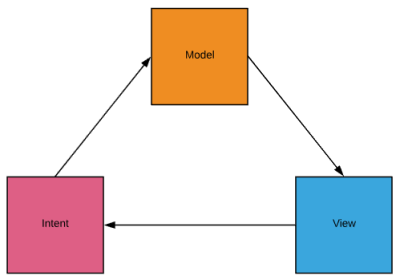
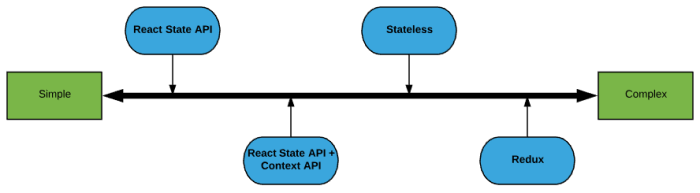

# React State Management

## Overview
This tutorial uses simple Pirate games to demonstrate `React` State Management
principals.

Objectives:
- Archetypal UI Architecture
- Why is State Management hard in `React`?
- Experimentation and Research
    * `React Component State API`
    * `React Context API`
    * Build your own State Container
    * `Redux`

## Archetypal UI Architecture

UI Architectures
- Model View Controller (MVC)
- Model View Presenter (MVP)
- Model View View-Model (MVVM)
- Model View Intent (MVI)

Does it matter?
- Absolutely, in some contexts it does

Does it matter to us?
- Maybe, but that's a problem for another day...
- Today, assume MVI is what we are *aspiring* to.

Model View Intent



- Model
    * Single source of truth
    * Holds entire state of the UI
        ```javascript
        let model = {};
        ```
- View
    * Transforms the model into a UI
    * At any moment, the UI can be generated from nothing but the model
    * `React` portion of the architecture.
        ```javascript
         let view = (m) => <.../>;
         ```
- Intent
    * User actions, system events, etc...
    * Intents are applied to the model, which is passed to the view to generate
        a new UI
        ```javascript 
        let update = (model, intent) => new_model;
       ```
- Essentially a finite state machine
    * Model represents all possible states
    * Intents represent all possible transitions

> #### Bottom Line:
> MVI is the UI architecture that we should be aspiring to. The model is the
> entirety of state. The view generates a UI from the model. Intents act upon
> the model to mutate the model.

> #### Quiz 1
> What portion of the MVI architecture does `React` provide?
>   * Model
>   * View
>   * Intent
>
> [Answers](Q1.md)

## Why is State Management Hard in React?
Why is State Management a larger concern in `React` than in other UI frameworks?

At `React`'s inception:
- Was not a *framework*, it was a *library*
- Only addressed the *view* portion of the domain
- Proverbial "Freedom vs. Productivity" Debate

Existing solutions for Model and Intent:
- `React` state management features added ex post facto
    * `Component State API`
    * `Context API`
- Popular State Management solutions
    * `Redux`
    * `MobX State Tree`
    * `Unstated` (the new hotness)
    * Soooooo many more
- Which one is best?
    * As with most things, it's highly context dependant
- Which one's are bad?
    * None, they all have intended use cases
- How do I know which one best fits my use case?
    * Experience, Experiment, and Research...

> #### Bottom Line:
> When using React, the Model and Intent portions of an MVI architecture must be
> supplied by the user. There are many "bolt on" options. While choices are
> good, they come with responsibility. The only way to make a good choice is to
> truly understand the alternatives.

> #### Quiz 2
> The fact that `React` forces developers to choose their own solution for
> managing state:
>   * is a prodigious evil so heinous that it is an affront on nature itself.
>   * is useful for applications with specialized needs.
>   * has a negative impact on productivity.
>   * is so profound that `React` apps are endowed with spiritual qualities.
>
> [Answers](Q2.md)

## Obligatory History and Conjecture
> Feel free to skip this section. The intent is to point out the somewhat
> capricious nature of the JS community. It should not be interrupted as a
> condemnation.  The speed at which the community iterates has many positive
> effects. Furthermore, the timeline is largely apocryphal.

A bit of history based on personal observation:

Sequence of Events:
- `React` has no mechanism for handling state
- Flux pattern (popular in desktop dev) rises to prominence
- Community declares flux boilerplate code tiresome, irksome even
- `Redux` implements Flux: WOO HOO! A framework that implements flux without the
    boilerplate. All of our dreams are manifest!
- `React` creates `Component State API`
- Community rejects `Component State API` because it's not "functional" and has a
    "prop drilling" problem.
- The `Redux` panacea start to crumble as community feels pain due to complexity
    and opacity.
- Factions in the community start to coalesce around new solutions such as
    `MobX`
- `React` implements `Context API`
- Factions in the community start proselytizing: "hey, maybe inherit `React`
    state management this isn't so bad..."
- Community says, "if `React` state management isn't so bad, we should create
    another framework" - and thus `Unstated` was born.

There has been much churn concerning best practices in this domain. Following
"standards" (using the term loosely) today does not shield against the future.
The JS world is fickle, we shouldn't be...

> #### Moral of this Story:
> Telling a developer that there is an existing mechanism for dealing with a
> challenge is like telling a musician that there is already a song about love.

## Experiment and Research
The best way to understand state management is via example. *Do not interpret
the example apps as canonical implementations*. They represent the minimum
amount of code required to communicate concepts.

One important note: none of these apps are necessarily better or worse than the
others. Each has pros and cons. It's helpful to envision a continuum as shown
below. A responsible engineer will choose the simplest solution that meets their
*current* needs. Don't try to predict the future, especially in an industry
defined by constant change.



Start by cloning this project with the following command:

```bash
git clone https://github.com/dalealleshouse/rading-react.git
```
Complete the exercises in each subsection below.

### React Component State API
The purpose of this section is to build competency with the `React State API` by
examining an example application.

> #### Exercise 1:
> 1. Navigate to the `state-api` directory and run the following commands:
>
>       ```bash
>       npm install
>       npm start
>       ```
> 2. Once the app loads, play the `Name that Pirate` game to familiarize
>    yourself with the app
>
> 3. Open the `state-api` folder using your favorite editor (your favorite
>    editor should be vim, but anyway...) and familiarize yourself with the
>    `React` components

#### Important Concepts:
- All state is maintained in `React.Component` `state` and `props`. Therefore,
    state is localized to each component.
  * `props` are immutable
  * `state` is mutable.

- While `state` is mutable, the means of mutation is constrained to the
    `setState` function.
  * `setState` informs the component and its children to re-render based on the
      new state.
  * Any mutations outside of `setState` will NOT trigger a re-render.

- State is shared between components via `props`.
    * Some `props` simply pass static data
    * Other `props` pass functions that can pass data back out of a component.
        (See example below)

    ``` javascript
    // When an answer is clicked, it passes its pirate property to it's parent
    // via the its onSelected property.
    // Answer.js
    ...
    <div
      className="card mb-3 answer"
      onClick={() => {
        if (!props.disabled) props.onSelected(props.pirate);
      }}>
    ...

    // GameBoard sets Answer's onSelected property to its own
    // handleAnswerSelected method. In this way, the parent (GameBoard) is able
    // to get data from it's child (Answer)
    // GameBoard.js
    ...
    <Answer
      key={p.name}
      pirate={p}
      onSelected={this.handleAnswerSelected}
      disabled={p.disabled}
    />
    ...
    ```

> #### Exercise 2:
> 1. Add a Reset Score button to the state-api app. When clicked, the button
>    should update the correct and incorrect counts to zero.

#### Pros
- Simplicity
- Little to no "magic" - no hidden logic

#### Cons
- Data sharing is only possible via a component Parent/Child relationship

### React Context API
This section expands on the previous section by adding `React Context API` to
the `Name That Pirate` game. 

> #### Exercise 3:
> 1. Navigate to the `context-api` directory and run the following commands:
>
>       ```bash
>       npm install
>       npm start
>       ```
> 2. Once the app loads, notice that the behavior is identical to previous app
>
> 3. Open the `context-api\src\AppProvider.js` file and study it's contents.
>    This is the only file that was added to the project.
>
> 4. Examine the changes made to the  `App.js`, `GameBoard.js`, and `Score.js`
>    files.

#### Important Concepts
- `React Context API` allows data to be shared between components that do not
    have a parent/child relationship.
    * In the previous app, in order for the `Score` and `GameBoard` to share
        data, the `App` component had to take responsibility for managing the
        correct and incorrect counts. This code is shown below.

    ```javascript
    // state-api App.js
    ...
      constructor(props) {
        ...
        this.state = {
          correct: 0,
          incorrect: 0,
        };
        ...
      }

      handleCorrectAnswer() {
        this.setState({
          correct: this.state.correct + 1,
        });
      }

      handleIncorrectAnswer() {
        this.setState({
          incorrect: this.state.incorrect + 1,
        });
      }

      render() {
      ...
            <GameBoard
              onCorrectAnswer={this.handleCorrectAnswer}
              onIncorrectAnswer={this.handleIncorrectAnswer}
            />
            <Score correct={this.state.correct} incorrect={this.state.incorrect} />
      ...
      }
      ...
    ```
    * `React Context API` uses a context to share data. The context is created
        in the component below. This component should be wrapped around any
        portions of the application that share state
    ``` javascript
    // App.js
    export const AppContext = React.createContext();

    export default class AppProvider extends React.Component {
      state = {
        correct: 0,
        incorrect: 0,
        incCorrect: () => {
          this.setState({correct: this.state.correct + 1});
        },
        incIncorrect: () => {
          this.setState({incorrect: this.state.incorrect + 1});
        },
      };

      render() {
        return (
          <AppContext.Provider value={this.state}>
            {this.props.children}
          </AppContext.Provider>
        );
      }
    }
    ```
    * The `AppProvider` defined above gets wrapped around `GameBoard` and
        `Score` so that they can share state.

    ``` javascript
    // App.js
    ...
    <AppProvider>
      <GameBoard />
      <Score />
    </AppProvider>
    ...
    ```
    * The `Score` component uses `AppContext.Consumer` to display state
        contained in the context.

    ``` javascript
    // Score.js
    ...
    <AppContext.Consumer>
      {context => context.correct}
    </AppContext.Consumer>
    ...
    ```
    * The `GameBoard` component uses the functions defined in the context to
        update state stored in the context.

    ``` javascript
    // GameBoard.js
    ...
    handleAnswerSelected(pirate, context) {
    ...
        context.incCorrect();
    ...
        context.incIncorrect();
    ...
    }
    ...
    <AppContext.Consumer>
      {context => {
        return this.state.turn.possiblities.map(p => (
          <Answer
            key={p.name}
            pirate={p}
            disabled={p.disabled}
            onSelected={p => this.handleAnswerSelected(p, context)}
          />
        ));
      }}
      ...
    ```

> #### Exercise 4:
> 1. Add a button to the App component in the location shown below.
>   ``` html
>     <AppProvider />
>       <GameBoard />
>       <Score />
>       NEW BUTTON GOES HERE
>     </AppProvider>
>   ```
> 2. Add a click handler to the new button that resets the correct and incorrect
>    counts to 0

#### Pros
- Simplicity
- Little to no "magic" - no hidden logic
- Data sharing is possible without a Parent/Child relationship via context

#### Cons
- The context can become unwieldy as it grows.

### Build Your Own State Container
The next step is to examine `Redux`. However, before diving straight in, it's
important to understand what `Redux` is trying to accomplish. This section
demonstrates a simple state container that mimics the core functionality of
`Redux`. It's curious how little code is required to accomplish this.

> #### Exercise 5:
> 1. Navigate to the `state-container` directory and run the following commands:
>
>   ```bash
>   npm install
>   npm start
>   ```
> 2. Once the app loads, play the `Pirate Tic Tac Toe game to familiarize
>    yourself with the app
>
> 3. Open the `state-container` folder using your favorite editor (again,
>    VIM...) and familiarize yourself with the application

#### Important Concepts
- The core functionality of `Redux` can be reproduced in 13 lines of code.
    Obviously, `Redux` does much more than this. However, this is the core.
    * The entire state in the store is held in the `internalState` private
        variable.
    * The store accepts a reducer that maps logic to intents. This is the only
        means of mutating the store's state.
    * The subscribe method accepts functions that will execute after every
        dispatch event. This is the typical mechanism by which `Redux` informs
        `React` that is should re-render the application.
    * The `getState` method simply returns the application state.

    ``` javascript
    // Store.js
    export const createStore = reducer => {
      let internalState = undefined;
      let handlers = [];

      return {
        dispatch: (intent, data) => {
          internalState = reducer(internalState, intent, data);
          handlers.forEach(h => h());
        },
        subscribe: handler => handlers.push(handler),
        getState: () => internalState,
      };
    };
    ```
- The `StateContainer.js` file is where the intents for the Pirate Tic Tac
    Toe application are defined. Each intent accepts a model and returns a new
    model. The model itself is never actually mutated, it's replaced with a new
    model.

    ``` javascript
    // StateContainer.js
    const intents = {
      PLAY: (model, data) => {
      ...
      },
      SCORE: model => {
      ...
      },
    };
    ```

- The application must instantiate a single global container to be used
    everywhere within the application.

    ``` javascript
    // StateContainer.js
    const update = (model = defaultState, intent, data) => {
      return intents[intent](model, data);
    };

    var container = createStore(update);
    ```

- Intents are joined with end user action in the view.

    ``` javascript
    // GameSquare.js
      onClick={() => {
        StateContainer.dispatch('PLAY', {
          row: props.row,
          square: props.square,
        });
        StateContainer.dispatch('SCORE');
      }}>
    ```

> #### Quiz 3
> What pattern does the Custom State Container adhere to?
>   * Observer
>   * State Machine
>   * Publisher/Subscriber
>   * Singleton
>
> [Answers](Q3.md)

> #### Exercise 6:
> 1. Add a new intent to `StateContainer.js` that will reset the game to it's
>    default state.
> 2. Add a button to the game that invokes the new intent via the state
>    container's dispatch method.

There are no pros and cons listed in this section because it's not advisable to
build a custom state container. This section is meant to merely convey the
concept about how `React` works under the hood.


# WIP - All text below this point is a work in progress

### Redux

### Unstated

Abstraction on top of Model-View-Intent that encapsulates the model and update
components.

Methods
- getState() - returns application state
- dispatch() - applies an intent to the state
- subscribe() - registers a callback to be called when the state changes


### `Redux`

- Useful when you have multiple components that need to share state that do not
    have a parent child relationship

- "...if you aren't sure if you need [Redux], you don't need it" - Pete Hunt

- When you choose redux to solve the prop-drilling problem, you're bringing in a
    cost that is intended to solve problems you don’t have and hence the cost is
    greater than the benefit.

Cory House
Putting `Redux` in our company framework by default was a mistake.
- People connect *every* component
- People embed `Redux` in "reusable" components
- Everyone uses `Redux`, even when they don't need it
- People don't know how to build an app with just `React`

    Intended to make flux more palatable 

    Provides a degree of standardization
    Opaque

---
Bibliography

While not directly quoted above, the following sources greatly influenced this
piece of work:

- Dan Abramov -
    https://medium.com/@dan_abramov/you-might-not-need-redux-be46360cf367
- Rajat S -
    https://blog.bitsrc.io/react-context-api-a-replacement-for-redux-6e20790492b3
- Kent C. Dodds -
    https://blog.kentcdodds.com/application-state-management-66de608ccb24
- Liam McLeenna -
    https://app.pluralsight.com/library/courses/react-fundamentals-update/table-of-contents
- Daniel Schulz -
    https://medium.com/dailyjs/comparison-of-state-management-solutions-for-react-2161a0b4af7b
